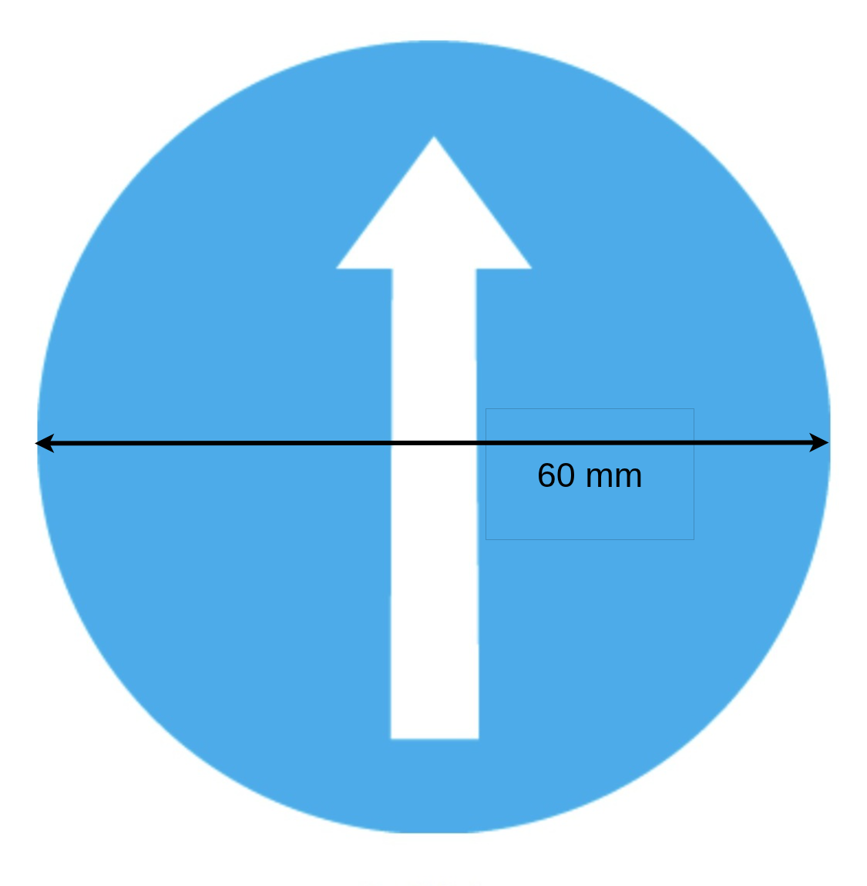
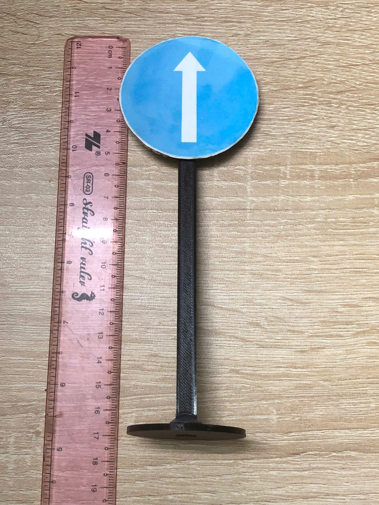
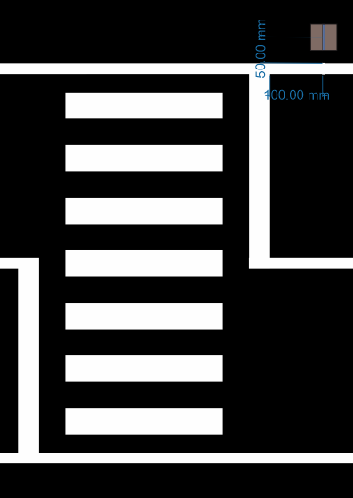

Biển báo giao thông
===================

Trên đường đua có thể xuất hiện các biển báo giao thông sau:

- Biển đi thẳng
- Biển rẽ trái
- Biển rẽ phải
- Biển cấm đi thẳng
- Biển cấm rẽ trái
- Biển cấm rẽ phải
- Biển STOP
- Biển đỗ xe (nâng cao)
- Biển báo nhiễu (nâng cao)

Bạn có thể tìm thấy các biển báo giao thông ở định dạng PDF (in ở khổ A4) tại đây:  `📄 Traffic signs <https://github.com/HieuTran2019/CDS-UTE---Documentation-Project/blob/main/docs/source/challenges/maps/Traffic_signs/bienbao_2.pdf>`_

Mỗi dấu hiệu được gói gọn trong một hình vuông **6x6 cm** (tỷ lệ tương ứng). Ví dụ minh họa:  

   **Hình 1.** Ví dụ biển báo kích thước 6x6 cm

Mỗi dấu hiệu được gắn trên đỉnh của một **trụ cột**, làm cho biển báo nằm ở mức **~17 cm**.  

   **Hình 2.** Ví dụ biển báo trên cột cao 17 cm

Mô hình 3D cột biển báo
-----------------------

Dưới đây là các mô hình 3D (STL) của trụ biển báo:

- `🗂 Chân trụ biển báo <https://github.com/HieuTran2019/CDS-UTE---Documentation-Project/blob/main/docs/source/challenges/3d-models/TrackParts/chantrubienbao_v2.STL>`_
- `🗂 Chân đế biển báo <https://github.com/HieuTran2019/CDS-UTE---Documentation-Project/blob/main/docs/source/challenges/3d-models/TrackParts/de_bien_bao_v5.STL>`_

Vị trí đặt biển báo
---------------------

Các vị trí của biển báo giao thông và đèn tín hiệu được đặt cách ~10 cm trước tín hiệu đường và ~5 cm ngoài giới hạn đường.

   **Hình 3.** Vị trí biển báo giao thông trong đường đua
