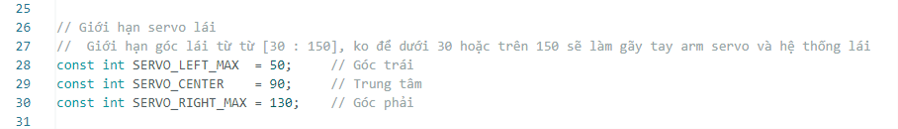
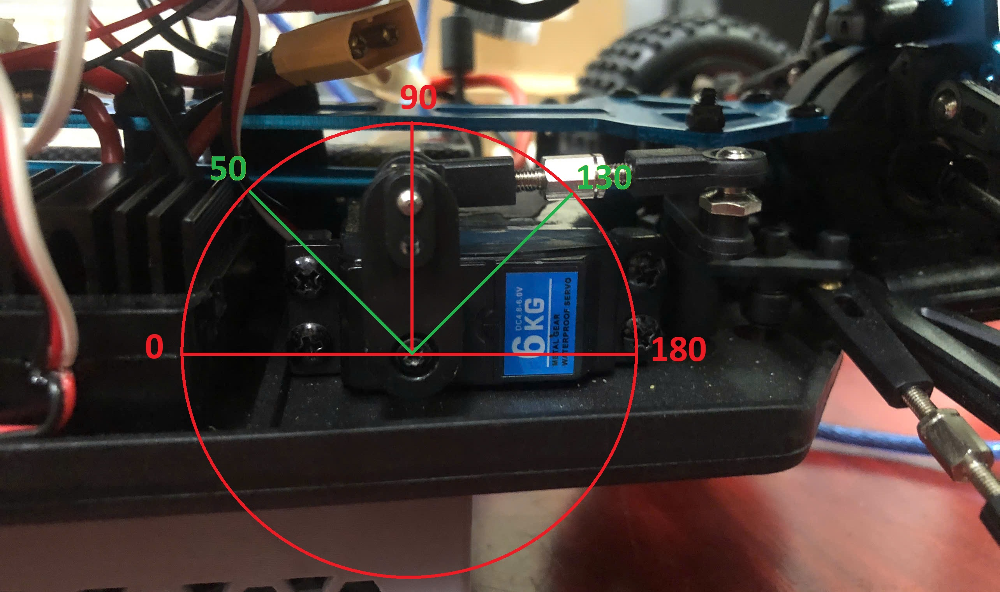

Hiệu chỉnh góc lái
==================

Mỗi chiếc xe RC đều được lắp ráp tỉ mỉ, tuy nhiên có thể tồn tại sai số nhỏ trong hiệu chỉnh góc lái do cơ cấu cơ khí.  
Ví dụ: khi bạn đặt góc lái thẳng (90°), bánh xe thực tế có thể lệch vài độ sang trái hoặc phải. Đây không phải lỗi, mà là đặc điểm tự nhiên của quá trình lắp ráp thủ công.

Giải pháp
---------

Để khắc phục sai số này, chúng tôi thiết lập các tham số khởi tạo nhằm giới hạn và hiệu chỉnh lại góc lái.

Tham khảo code Arduino tại đây:  
`Control_CDS_ver3.ino <https://github.com/HieuTran2019/CDS_UTE_2025/blob/main/utils/Control_CDS_ver3/Control_CDS_ver3.ino>`_

Ở đầu code, bạn sẽ thấy các tham số cố định (Hình 1):

   **Hình 1.** Các tham số cấu hình góc lái trong code

Nguyên lý tín hiệu Servo
------------------------

Servo lái được điều khiển dựa vào độ rộng xung PWM:

- **1000µs → 1500µs**: quay sang trái (0° → 90°)  
- **1500µs**: vị trí trung tâm (90°)  
- **1500µs → 2000µs**: quay sang phải (90° → 180°)  

Một số điểm quan trọng:

- Cơ cấu lái thực tế của xe **không sử dụng toàn bộ dải 0° → 180° của servo**.  
  Giới hạn an toàn thường nằm trong khoảng **50° → 130°**.  
- Vượt quá giới hạn này có thể khiến servo bị kẹt, quá tải và cháy; hoặc làm gãy các khớp cơ khí (Hình 2).  
- Nếu ở vị trí **90° không trùng với hướng thẳng của xe**, bạn có thể hiệu chỉnh lại bằng tham số `SERVO_CENTER`.

   **Hình 2.** Giới hạn góc lái an toàn

Tổng kết các tham số
--------------------

Bạn có thể tinh chỉnh lại các tham số góc lái để phù hợp với từng xe:

- `SERVO_LEFT_MAX  = 50;`   → Góc trái tối đa  
- `SERVO_CENTER    = 90;`   → Vị trí trung tâm  
- `SERVO_RIGHT_MAX = 130;`  → Góc phải tối đa  

Ví dụ cấu hình:

.. code-block:: cpp

    // Giới hạn servo lái
    const int SERVO_LEFT_MAX  = 50;   // Góc trái tối đa
    const int SERVO_CENTER    = 90;   // Trung tâm
    const int SERVO_RIGHT_MAX = 130;  // Góc phải tối đa
