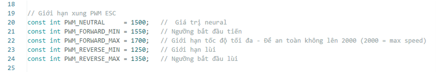
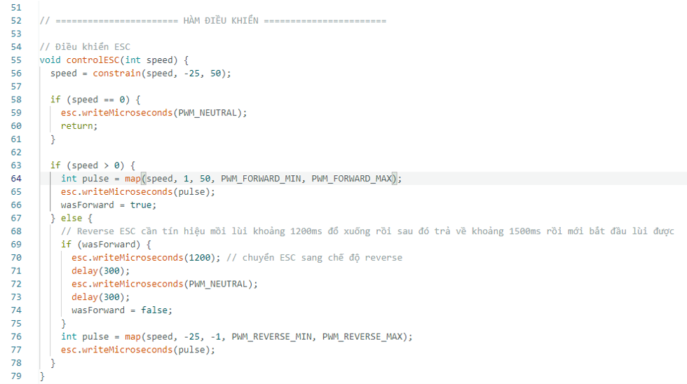
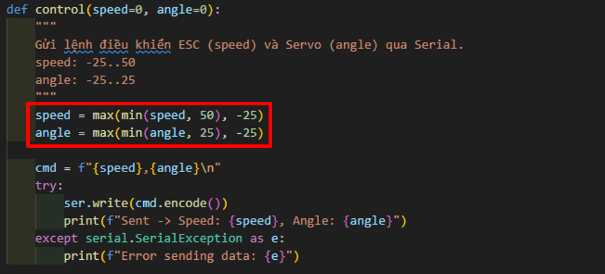

Hiệu chỉnh tốc độ
=================

Như một phần trong cam kết mang đến trải nghiệm tốt nhất, mỗi người tham gia sẽ nhận được một chiếc xe RC đã được lắp ráp tỉ mỉ.  
Tuy nhiên, có thể tồn tại những sai số nhỏ trong hiệu chỉnh tốc độ do quá trình lắp ráp thủ công.  

Đây không phải là lỗi, mà là đặc điểm tự nhiên trong sản xuất và có thể hiệu chỉnh bằng phần mềm.

Giải pháp
---------

Để khắc phục sai số này, tôi đã thiết lập các tham số khởi tạo nhằm xử lý những sai số nhỏ này trong hiệu chỉnh góc lại.

Về điều khiển, tôi sử dụng **thư viện Servo** để điều khiển ESC (Electronic Speed Controller), vì ESC cũng nhận tín hiệu xung trong khoảng **1000µs → 2000µs**.

Tham khảo code Arduino tại đây:  
`Control_CDS_ver3.ino <https://github.com/HieuTran2019/CDS_UTE_2025/blob/main/utils/Control_CDS_ver3/Control_CDS_ver3.ino>`_

Ở đầu code, bạn sẽ thấy các tham số cố định (Hình 1):

   **Hình 1.** Các tham số cấu hình PWM trong code

Nguyên lý tín hiệu ESC
----------------------

ESC điều khiển tiến/lùi dựa vào độ rộng xung PWM:

- **1000µs → 1500µs**: Lùi (-100% → 0%)  
- **1500µs**: Trung tính (0%, xe dừng)  
- **1500µs → 2000µs**: Tiến (0% → 100%)  

Một số điểm quan trọng:

- Nếu không cần tốc độ tối đa, hãy **giới hạn PWM_FORWARD_MAX**  
  Ví dụ: `PWM_FORWARD_MAX = 1700` → tốc độ tối đa chậm hơn so với 2000µs.

- Khi lùi:  

  1. Gửi tín hiệu nhỏ hơn 1300µs (ví dụ 1200µs) trong ~300ms để ESC xác nhận.  
  2. Trả lại **neutral = 1500µs**.  
  3. Sau đó mới gửi dải xung 1500 → 1000µs để xe lùi.  

- Khi phanh:  
  Nếu xe đang chạy tiến (`> 1500µs`), chỉ cần gửi tín hiệu `< 1200µs`, xe sẽ **phanh gấp**.  
  Cách này hiệu quả hơn so với chỉ trả về **1500µs** (xe sẽ trôi). (chưa tích hợp vào code Control_CDS_ver3)  

Hàm điều khiển ESC
------------------

Hình 2 minh họa hàm điều khiển ESC trong STM32:

   **Hình 2.** Hàm điều khiển ESC trong code STM32

Tổng kết các tham số
--------------------

Bạn có thể tinh chỉnh lại các tham số PWM và giới hạn phần mềm để phù hợp với từng xe.

1. Chỉnh sửa trong file code Arduino  
   `Control_CDS_ver3.ino <https://github.com/HieuTran2019/CDS_UTE_2025/blob/main/utils/Control_CDS_ver3/Control_CDS_ver3.ino>`_:

- `PWM_NEUTRAL      = 1500`   → Vị trí trung tính (xe đứng yên)  
- `PWM_FORWARD_MIN  = 1550`   → Ngưỡng bắt đầu tiến (tăng nếu xe chưa chạy được)  
- `PWM_FORWARD_MAX  = 1700`   → Giới hạn tốc độ tiến tối đa (giảm nếu muốn xe chậm lại)  
- `PWM_REVERSE_MIN  = 1250`   → Giới hạn tốc độ lùi tối đa (tăng nếu muốn xe lùi chậm lại)  
- `PWM_REVERSE_MAX  = 1350`   → Ngưỡng bắt đầu lùi (giảm nếu xe không lùi được)  

2. Chỉnh sửa trong file Python  
   `control.py <https://github.com/HieuTran2019/CDS_UTE_2025/blob/main/utils/control.py>`_:

- `speed = max(min(speed, 50), -25)`  
  → Giới hạn tốc độ do phần mềm. Xe không bao giờ vượt quá 50 (tiến) hoặc -25 (lùi).  

- `angle = max(min(angle, 25), -25)`  
  → Giới hạn góc lái trong khoảng [-25°, 25°] để tránh servo vượt quá giới hạn cơ khí.  

   **Hình 3.** Điều chỉnh giới hạn tốc độ trong code

Ví dụ cấu hình trong Arduino:

.. code-block:: cpp

    // Giới hạn xung PWM ESC
    const int PWM_NEUTRAL     = 1500;   // Giá trị trung tính (xe đứng yên)
    const int PWM_FORWARD_MIN = 1550;   // Ngưỡng bắt đầu tiến
    const int PWM_FORWARD_MAX = 1700;   // Giới hạn tốc độ tiến tối đa
    const int PWM_REVERSE_MIN = 1250;   // Giới hạn tốc độ lùi tối đa
    const int PWM_REVERSE_MAX = 1350;   // Ngưỡng bắt đầu lùi

Tham khảo thêm:  
`Điều khiển ESC <https://github.com/Tales-sv/Esp32-ESC_Controler>`_
