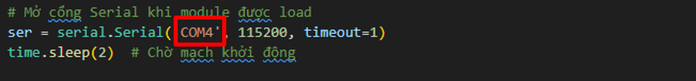

Lập trình điều khiển
======================

Tổng quan
---------

Chương trình sẽ cung cấp cho bạn một giá trị đầu vào:

- **image**: hình ảnh trả về từ xe.  
- **Hàm điều khiển**: `control(speed, angle)` với các tham số:  

  + `angle` (góc điều khiển): giá trị trong khoảng **[-25, 25]**  
    *Âm* → góc trái, *Dương* → góc phải  

  + `speed` (tốc độ điều khiển): giá trị trong khoảng **[-25, 50]**  
    *Âm* → lùi, *Dương* → tiến  

Hướng dẫn chạy chương trình
---------------------------

Xem code tại repo:  

`CDS_UTE_2025 <https://github.com/HieuTran2019/CDS_UTE_2025>`_

Trước khi chạy, bạn cần chỉnh **port** mà STM32 kết nối với Orange Pi.  
Trên Orange Pi, thông thường port sẽ là **/dev/ttyACM0**  

Sau đó, để khởi chạy chương trình điều khiển, bạn dùng lệnh:

.. code-block:: bash

   python client.py

Khi chạy, tín hiệu **speed** và **angle** sẽ được gửi từ Orange Pi đến STM32 thông qua cổng **STLink** (dây cáp USB).  

**Lưu ý:** đảm bảo bạn đã nhấn nút **Start (màu xanh lá)** và LED on-board trên STM32 đã sáng.  

Hướng dẫn code STM32
---------------------

Trong dự án này, STM32 được lập trình bằng công cụ **Arduino IDE**.  
Bạn có thể xem hướng dẫn chi tiết tại:  

`utils/README.md <https://github.com/HieuTran2019/CDS_UTE_2025/blob/main/utils/README.md>`_

Phiên bản code **Control_CDS_ver3** là phiên bản hoàn thiện cuối cùng.  
Tuy nhiên, bạn hoàn toàn có thể hiệu chỉnh các tham số hoặc mở rộng thêm nếu muốn.  

Điều chỉnh tốc độ và góc lái
----------------------------

Dưới đây là hai phần hướng dẫn chi tiết để hiệu chỉnh:

.. toctree::
   :maxdepth: 2
   :caption: Nội dung:

   img/speed
   img/angle
