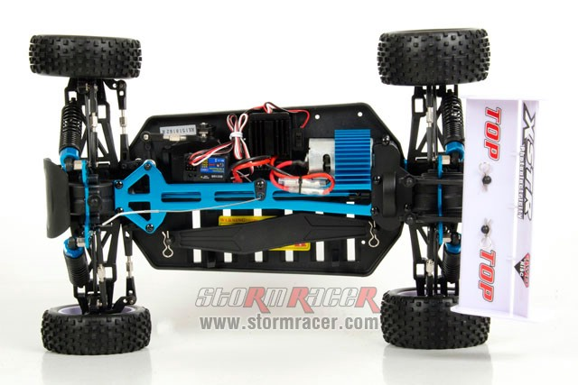
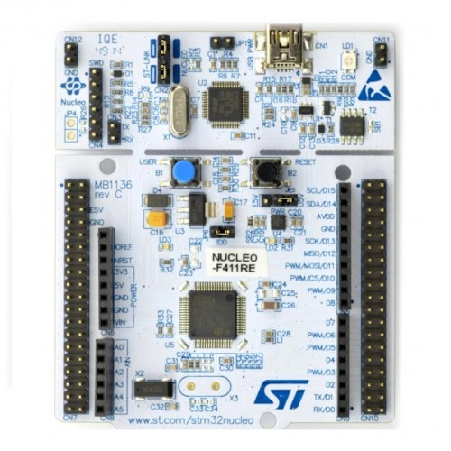

Thành phần chi tiết
===================

Dưới đây là thông tin chi tiết các thành phần có trên xe bao gồm hình ảnh minh họa, đường link mua sản phẩm

- `Chassis <https://www.stormracer.com/sanpham/xe-dieu-khien/1-10-electric-xe-dien/hsp-1-10-electric-buggy-4wd-94107_01030089.product>`_ 

- `Servo <https://www.stormracer.com/sanpham/xe-dieu-khien/1-10-electric-xe-dien/hsp-1-10-electric-buggy-4wd-94107_01030089.product>`_  

.. figure:: servo_6kg.jpeg
    :alt: Servo 6kg
    :width: 250px
    :align: center

- `Motor 50T <https://www.stormracer.com/sanpham/dong-co-dien/motor-dien-for-rc-car/modified-motor-rs-540-50t-high-torque-brushed-motor_12050010.product>`_  
  
.. figure:: HH_Motor_50T_004.jpg
    :alt: Động cơ RS-540 50T
    :width: 250px
    :align: center

- `Controller (STM32 Nucleo F411RE) <https://www.proe.vn/kit-stm32f411-nucleo-nucleo-f411re>`_  

- `Camera Logitech C270 <https://tinhocngoisao.com/products/webcam-logitech-c270-hd-720p>`_  

.. figure:: ../electronics/Logitech_C270.jpeg
    :alt: Camera Logitech C270
    :width: 250px
    :align: center

- `Battery (Vant Lipo 3S 5200mAh 50C) <https://www.stormracer.com/sanpham/pin-may-sac/pin-lipo-lipo-battery/vant-battery-lipo-3s-111v-5200mah-50c-grade-a_11030088.product>`_  

.. figure:: ../electronics/Vant_5200mAh-50C-3S_006.jpg
    :alt: Pin Lipo 3S 5200mAh
    :width: 250px
    :align: center

.. - `IMU Sensor (BNO055) <https://www.proe.vn/adafruit-9-dof-absolute-orientation-imu-fusion-breakout-bno055>`_  

.. .. figure:: electronics/BNO555.jpeg
..     :alt: Cảm biến IMU BNO055
..     :width: 250px
..     :align: center

