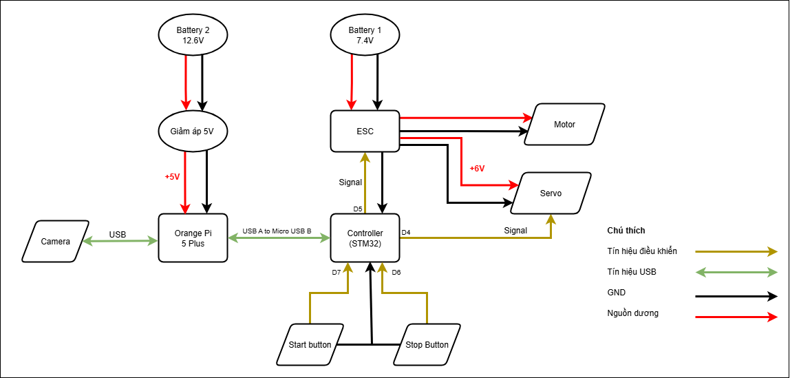

Sơ đồ kết nối
----------------

Trong **Hình 1**, bạn có thể thấy sơ đồ kết nối của tất cả các thành phần phần cứng của xe. 
Các chân GPIO được đánh dấu trực tiếp trên từng thành phần.

   **Hình 1.** Sơ đồ kết nối tổng thể

Hệ thống sẽ sử dụng **hai cục pin**:

- **Pin LiPo 3S**: cung cấp điện cho Orange Pi, đi qua UBEC 5V (mạch giảm áp) để hạ áp xuống mức 5V.  
  UBEC giúp ổn định điện áp 5V và cung cấp dòng cao, đảm bảo Orange Pi hoạt động tốt.  

- **Pin Ni-MH 6 cell**: cung cấp điện cho ESC để điều khiển động cơ.  
  Đồng thời nguồn từ ESC cũng cấp cho servo, nhưng được đưa qua một cầu chì 3A để tránh quá tải, bảo vệ servo.  

**STM32** được cấp nguồn thông qua cổng USB mini từ Orange Pi.  
Cần chú ý jumper trên board STM32 phải chọn **USB** thay vì **E5V** (vị trí khoanh đỏ số 1 trong Hình 2).  
Ngoài ra, dù sử dụng nhiều nguồn khác nhau, tất cả cần **đồng bộ chung GND** để tín hiệu điều khiển chính xác (xem Hình 2 và Hình 3).  

STM32 được kết nối đến **mạch chia điện** thông qua dây bus (ô đỏ số 3 trong Hình 2).  
Cần chú ý hướng cắm, chân bắt đầu từ D7 đến D2.  

   **Hình 2.** STM32 và các kết nối quan trọng

Đây là **mạch chia điện**, các đầu connector được thiết kế giống với sơ đồ tổng thể ở Hình 1.  
Các đầu nối loại XH2.54mm giúp việc thay thế và sửa chữa thuận tiện hơn.  
Trên board còn có **LED màu xanh lá** để báo hiệu có điện từ ESC.

   **Hình 3.** Mạch chia điện

Xe được trang bị **hai nút nhấn** (màu xanh và màu đỏ), đều được lập trình bằng ngắt ngoài:  

- **Nút đỏ**: dừng chương trình điều khiển. Khi nhấn, tốc độ (`speed`) và góc lái (`angle`) sẽ trở về 0, đồng thời LED P13 tắt (Hình 4).  

   **Hình 4.** Trạng thái khi dừng chương trình (nút đỏ – LED P13 tắt)

- **Nút xanh**: khởi động chương trình điều khiển trong STM32. Khi nhấn, LED P13 trên board STM32 sáng và chương trình bắt đầu chạy (Hình 5).  

   **Hình 5.** Trạng thái khi chạy chương trình (nút xanh – LED P13 sáng)
