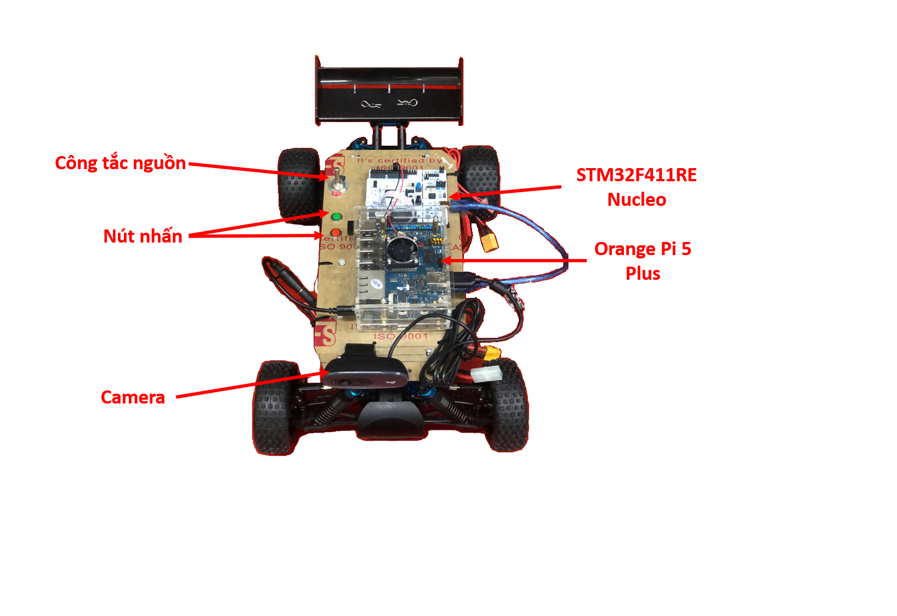
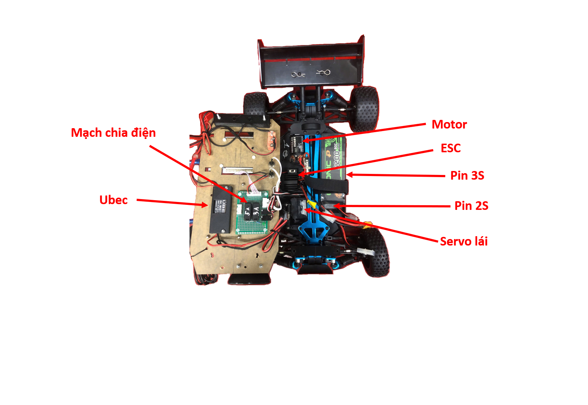

Thông số chung và các thành phần
================================

.. toctree::
   :maxdepth: 1
   :caption: Nội dung:

   car/specs
   3d-models/in3D
   electronics/electronics

Tổng quan
-------------------

Đây là mô tả tổng quan của chiếc xe, với tất cả các thành phần của nó:

Mặt phía trên với các thành phần (minh họa ở hình 1):

- Orange Pi 5 Plus: bộ xử lý trung tâm, thực hiện các tác vụ AI, xử lý ảnh, nhận diện làn đường, biển báo và gửi tín hiệu điều khiển đến STM32.
- Board STM32F411RE: bộ điều khiển chính để điều khiển động cơ xe và servo.
- Camera Logitech: cung cấp hình ảnh cho Orange Pi.
- Công tắc nguồn: công tắc tổng, cấp nguồn từ pin LiPo 3S đến UBEC để cấp điện cho Orange Pi.
- Hai nút nhấn: nút xanh để khởi động STM32, nút đỏ để tắt chương trình chạy trên STM32.

   **Hình 1.** Mặt trên của chiếc xe

------

Mặt dưới là các thành phần gồm(minh họa ở hình 2):

- Pin LiPo 3S: cung cấp điện cho Orange Pi.
- Pin Ni-MH 6 cell (7.2V) dung lượng 2000mAh: cung cấp điện cho motor và servo.
- Mạch UBEC 5V 8A: giúp ổn định nguồn 5V cho Orange Pi hoạt động.
- Mạch chia điện: do nhóm thiết kế, giúp đi dây gọn gàng, dễ thay thế, tích hợp cầu chì 3A bảo vệ servo.
- Servo: điều khiển cơ cấu lái.
- ESC: điều khiển động cơ.
- Động cơ: cung cấp mô-men xoắn, giúp xe chạy khỏe trên nhiều loại địa hình.

   **Hình 2.** Mặt dưới của chiếc xe
