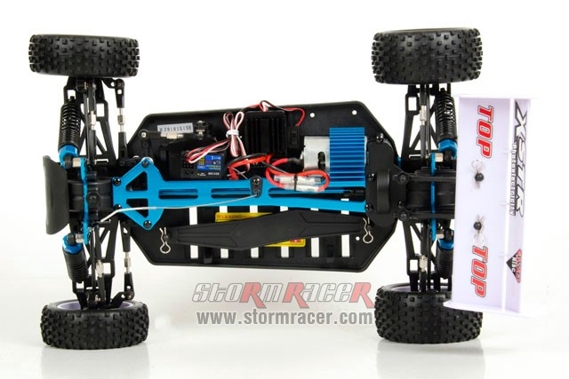
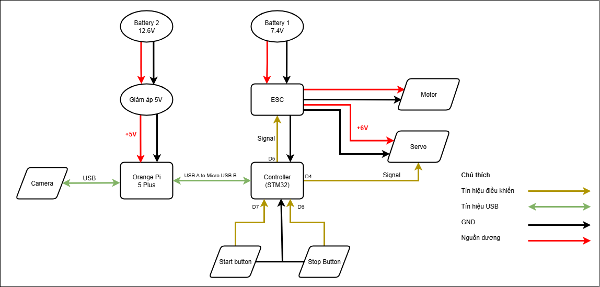
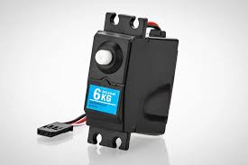
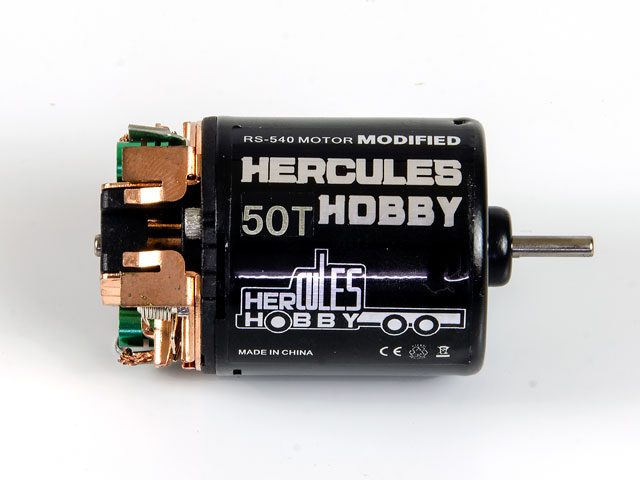
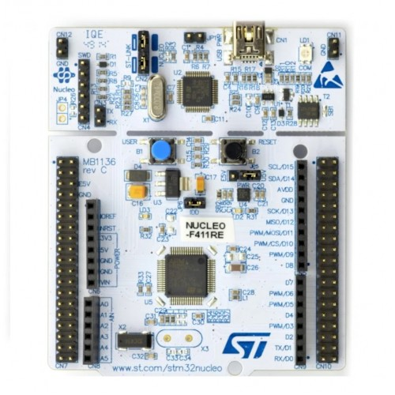
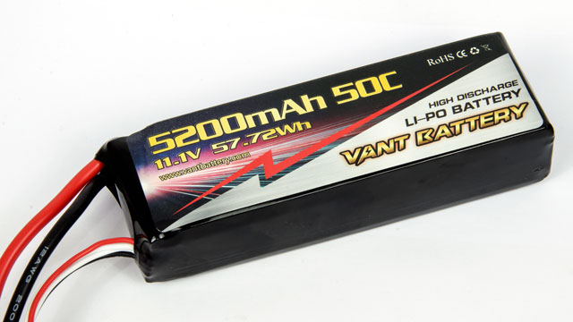
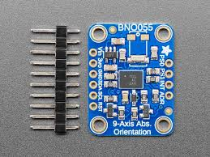

Sơ đồ kết nối và các thành phần
================================

Đây là mô tả của chiếc xe, với tất cả các thành phần của nó:

Sơ đồ kết nối
----------------

Trong các sơ đồ dưới đây, bạn có thể thấy sơ đồ kết nối của tất cả các thành phần phần cứng của xe. 
Các chân GPIO được đánh dấu trên từng thành phần

---

Thành phần chi tiết
-------------------

- `Chassis <https://www.stormracer.com/sanpham/xe-dieu-khien/1-10-electric-xe-dien/hsp-1-10-electric-buggy-4wd-94107_01030089.product>`_ 

- `Servo <https://www.stormracer.com/sanpham/xe-dieu-khien/1-10-electric-xe-dien/hsp-1-10-electric-buggy-4wd-94107_01030089.product>`_  

- `Motor 50T <https://www.stormracer.com/sanpham/dong-co-dien/motor-dien-for-rc-car/modified-motor-rs-540-50t-high-torque-brushed-motor_12050010.product>`_  
  

- `Controller (STM32 Nucleo F411RE) <https://www.proe.vn/kit-stm32f411-nucleo-nucleo-f411re>`_  

- `Camera Logitech C270 <https://tinhocngoisao.com/products/webcam-logitech-c270-hd-720p>`_  

.. figure:: electronics/Logitech_C270.jpeg
  :alt: Camera Logitech C270
  :width: 250px
  :align: center

- `Battery (Vant Lipo 3S 5200mAh 50C) <https://www.stormracer.com/sanpham/pin-may-sac/pin-lipo-lipo-battery/vant-battery-lipo-3s-111v-5200mah-50c-grade-a_11030088.product>`_  

- `IMU Sensor (BNO055) <https://www.proe.vn/adafruit-9-dof-absolute-orientation-imu-fusion-breakout-bno055>`_  

Các thành phần in 3D
--------------------

Và đây là các thành phần in 3D cho chính chiếc xe. 
Cũng có sẵn ở định dạng có thể chỉnh sửa, như tiện ích mở rộng SLDPRT tại liên kết này: 
`solid parts <https://github.com/HieuTran2019/CDS-UTE---Documentation-Project>`_

- `Camera support <https://tinhocngoisao.com/products/webcam-logitech-c270-hd-720p>`_  

.. figure:: electronics/Logitech_C270.jpeg
  :alt: Camera Logitech C270
  :width: 250px
  :align: center